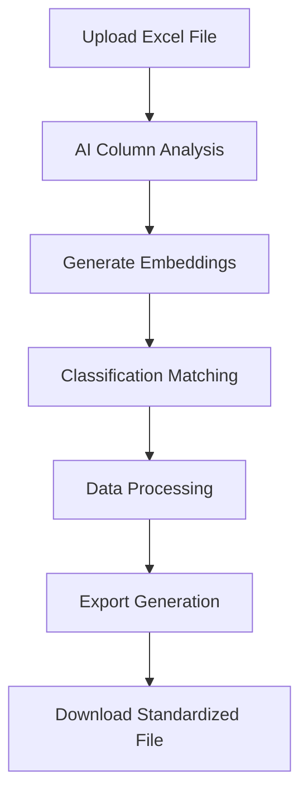

# Excel Processor for Electronic Components

<div align="center">

**An intelligent Excel processing application that standardizes non-uniform component data using artificial intelligence**

[Features](#features) • [Demo](#demo) • [Installation](#installation) • [Usage](#usage) • [API Reference](#api-reference) • [Contributing](#contributing)

</div>

---

## 🚀 Overview

Excel Processor is a sophisticated Rails application designed to automatically standardize and enrich electronic component data from diverse Excel formats. Leveraging OpenAI's cutting-edge AI technology, it intelligently maps columns, classifies products using embeddings, and generates standardized output files with minimal human intervention.

### Key Capabilities

- **🧠 Intelligent Column Recognition**: Automatically identifies column mappings using AI
- **📊 Smart Data Classification**: Classifies components using semantic embeddings
- **⚡ Asynchronous Processing**: Handles large files without blocking the interface
- **🎯 Scope Determination**: Automatically determines if items are "In Scope" or "Out of Scope"
- **📈 Real-time Updates**: Live status tracking with automatic UI updates
- **🔄 Iterative Learning**: Improves classification accuracy over time

---

## 🌟 Features

### Core Functionality

| Feature | Description |
|---------|-------------|
| **Multi-format Support** | Process `.xlsx`, `.xls`, and `.csv` files |
| **AI Column Mapping** | Automatically maps source columns to standardized schema |
| **Semantic Classification** | Uses OpenAI embeddings for intelligent product categorization |
| **Batch Processing** | Efficiently handles files with thousands of rows |
| **Error Recovery** | Robust error handling with detailed logging |
| **Export Generation** | Creates standardized Excel files with consistent formatting |

### Advanced Features

- **Commodity Reference Management**: Maintain and update classification databases
- **Custom Mapping Corrections**: Manual override capabilities for edge cases
- **Historical Processing**: Track and review all processed files
- **Sample File Generation**: Built-in examples and templates

---

## 🎬 Demo

### Processing Workflow



### Input vs Output

**Input (Non-standardized):**
```
Part ID | SKU Number | Item Description | Unit Cost ($)
SG123456 | CAP-001 | Capacitor 100µF 25V | $0.45
```

**Output (Standardized):**
```
SUGAR_ID | ITEM | DESCRIPTION | STD_COST | Commodity | Scope
SG123456 | CAP-001 | Capacitor 100µF 25V | 0.45 | Capacitors | In scope
```

---

## 📋 Requirements

### System Requirements

- **Ruby**: `>= 3.2.2`
- **Rails**: `>= 7.1.0`
- **Database**: PostgreSQL `>= 12`
- **Node.js**: `>= 16.0` (for asset compilation)
- **Memory**: Minimum 2GB RAM recommended

### API Dependencies

- **OpenAI API**: Valid API key required
- **Models Used**:
  - `text-embedding-3-small` (for embeddings)
  - `gpt-4-turbo` (for column identification)

---

## 🛠 Installation

### Quick Start

```bash
# Clone the repository
git clone https://github.com/JuanFLex/excel-processor.git
cd excel-processor

# Install dependencies
bundle install
yarn install

# Database setup
rails db:create
rails db:migrate
rails db:seed

# Configure OpenAI credentials
EDITOR=nano rails credentials:edit
```

### Environment Configuration

Add to your Rails credentials:

```yaml
openai:
  api_key: your_openai_api_key_here 
  organization_id: your_org_id_here  # optional
```

### Asset Compilation

```bash
# For development
bin/dev

# For production
rails assets:precompile
rails tailwindcss:build
```

---

## 📚 Usage

### Basic Workflow

1. **Access the Application**
   ```
   http://localhost:3000
   ```

2. **Upload a File**
   - Navigate to "Upload New File"
   - Select your Excel/CSV file
   - Click "Process File"

3. **Monitor Processing**
   - Real-time status updates
   - Automatic page refresh on completion

4. **Download Results**
   - Review processed items
   - Download standardized Excel file

### Supported Output Schema

| Column | Type | Description |
|--------|------|-------------|
| `SUGAR_ID` | String | Item identifier (optional) |
| `ITEM` | String | Item code |
| `MFG_PARTNO` | String | Manufacturer part number |
| `GLOBAL_MFG_NAME` | String | Manufacturer name |
| `DESCRIPTION` | Text | Item description |
| `SITE` | String | Location/facility |
| `STD_COST` | Float | Standard cost |
| `LAST_PURCHASE_PRICE` | Float | Last purchase price |
| `LAST_PO` | Float | Last purchase order amount |
| `EAU` | Integer | Estimated Annual Usage |
| `Commodity` | String | AI-generated classification |
| `Scope` | String | In scope / Out of scope |

---

## 🔧 Configuration

### Commodity Reference Management

The application uses a hierarchical commodity classification system:

```csv
GLOBAL_COMM_CODE_DESC,LEVEL1_DESC,LEVEL2_DESC,LEVEL3_DESC,Infinex Scope Status
Electronic Components,Passive Components,Capacitors,Ceramic Capacitors,In Scope
Electronic Components,Passive Components,Resistors,Chip Resistors,In Scope
```

### Performance Tuning

```ruby
# config/environments/production.rb
config.active_job.queue_adapter = :async
config.active_job.queue_adapter.max_threads = ENV.fetch("MAX_THREADS", 5).to_i
```

---

## 🧪 Testing

### Running Tests

```bash
# Run all tests
bundle exec rspec

# Run specific test files
bundle exec rspec spec/models/
bundle exec rspec spec/services/

# Generate coverage report
COVERAGE=true bundle exec rspec
```

### Test Coverage

- **Models**: Unit tests for all ActiveRecord models
- **Services**: Integration tests for AI services
- **Controllers**: Request/response testing
- **Jobs**: Asynchronous processing validation

---

## 🚀 Deployment

### Production Setup

```bash
# Precompile assets
RAILS_ENV=production rails assets:precompile

# Run database migrations
RAILS_ENV=production rails db:migrate

# Start the application
RAILS_ENV=production rails server
```


### Environment Variables

```bash
RAILS_ENV=production
RAILS_MASTER_KEY=your_master_key_here
MAX_THREADS=5
```

---

## 📊 Performance & Scalability

### Benchmarks

| File Size | Rows | Processing Time | Memory Usage |
|----------|------|----------------|--------------|
| Small | 100-500 | 30-60 seconds | ~200MB |
| Medium | 500-2000 | 2-5 minutes | ~400MB |
| Large | 2000-5000 | 5-15 minutes | ~800MB |

### Optimization Features

- **Batch Processing**: Processes items in configurable batches
- **Embedding Caching**: Reduces redundant API calls
- **Asynchronous Execution**: Non-blocking file processing
- **Memory Management**: Efficient handling of large datasets

---

## 🤝 Contributing

### Development Setup

```bash
# Fork and clone the repository
git clone https://github.com/your-username/excel-processor.git

# Create a feature branch
git checkout -b feature/your-feature-name

# Make your changes and test
bundle exec rspec

# Submit a pull request
```

### Code Standards

- Follow Ruby Style Guide
- Maintain test coverage above 90%
- Document new features
- Use semantic commit messages

### Issue Reporting

When reporting issues, please include:
- Ruby/Rails version
- Error logs
- Sample data (anonymized)
- Steps to reproduce

---

## 📖 API Reference

### Key Services

#### `OpenaiService`
```ruby
# Generate embeddings
OpenaiService.get_embeddings(["text1", "text2"])

# Identify columns
OpenaiService.identify_columns(sample_rows, target_columns)
```

#### `ExcelProcessorService`
```ruby
# Process uploaded file
processor = ExcelProcessorService.new(processed_file)
processor.process_upload(uploaded_file)
```

---

## 🛡 Security

### Data Protection
- API keys stored in encrypted Rails credentials
- No sensitive data logged
- Temporary files automatically cleaned up
- SQL injection protection via ActiveRecord

### Best Practices
- Regular dependency updates
- Input validation and sanitization
- Secure file upload handling
- Rate limiting for API calls

---

## 🐛 Troubleshooting

### Common Issues

| Issue | Cause | Solution |
|-------|--------|----------|
| Processing fails | Invalid OpenAI API key | Check credentials configuration |
| Column mapping errors | Unclear column headers | Use manual mapping correction |
| Memory issues | Large file processing | Increase server memory or batch size |
| Asset loading problems | Missing Tailwind compilation | Run `rails tailwindcss:build` |

### Debug Mode

```bash
# Enable detailed logging
RAILS_LOG_LEVEL=debug rails server

# Check processing status
rails console
> ProcessedFile.last.status
```
